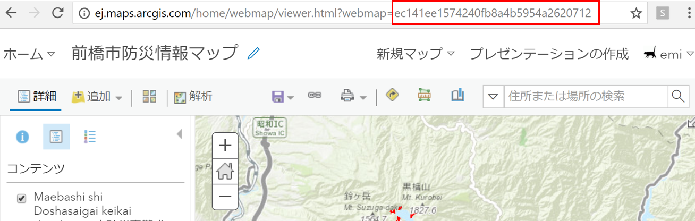

# 防災情報アプリを作成してみよう

## 概要

この手順書では、避難場所と洪水ハザードマップ、土砂災害警戒区域のデータを使用した Web マップの作成、および作成した Web マップから Web AppBuilder for ArcGIS を使用して Web アプリケーションを作成する方法をご紹介しています。 

## 1. Web マップの作成

ArcGIS Online へサインインし、[Web マップ](https://www.esrij.com/gis-guide/web-gis/web-map/)を作成します。

### 1. ArcGIS Online へアクセス

[ArcGIS Online](https://www.arcgis.com/home/)へアクセスし、ArcGIS for Developers のユーザー名とパスワードを入力してサイン インします。  
[マップ] をクリックして、マップビューアーを開きます。

### 2. Web マップの作成

マップビューアーを使用して、アプリケーションで利用する Web マップを構築します。

#### データの入手

Web マップで使用するデータを入手します。
今回は、前橋市がオープンデータとして公開している下記のデータを使用します。
* [前橋市 洪水ハザードマップ L1](http://data.esrij.com/datasets/%E5%89%8D%E6%A9%8B%E5%B8%82-%E6%B4%AA%E6%B0%B4%E3%83%8F%E3%82%B6%E3%83%BC%E3%83%89%E3%83%9E%E3%83%83%E3%83%97-l1?geometry=137.956%2C36.177%2C139.103%2C36.564)
* [前橋市 洪水ハザードマップ L2](http://data.esrij.com/datasets/%E5%89%8D%E6%A9%8B%E5%B8%82-%E6%B4%AA%E6%B0%B4%E3%83%8F%E3%82%B6%E3%83%BC%E3%83%89%E3%83%9E%E3%83%83%E3%83%97-l2)
* [前橋市 洪水ハザードマップ L3](http://data.esrij.com/datasets/c7cb7955455240e9a0ffd91d47b6e41f_0)
* [前橋市 洪水ハザードマップ L4](http://data.esrij.com/datasets/%E5%89%8D%E6%A9%8B%E5%B8%82-%E6%B4%AA%E6%B0%B4%E3%83%8F%E3%82%B6%E3%83%BC%E3%83%89%E3%83%9E%E3%83%83%E3%83%97-l4)
* [前橋市 土砂災害警戒区域 土石流](http://data.esrij.com/datasets/02b68d552bf642e2b4ef8b80e4ba3f56_0)
* [前橋市 一時避難場所](http://data.esrij.com/datasets/%E5%89%8D%E6%A9%8B%E5%B8%82-%E4%B8%80%E6%AC%A1%E9%81%BF%E9%9B%A3%E5%A0%B4%E6%89%80)
* [前橋市 二次避難場所](http://data.esrij.com/datasets/b54cc368133246d2ad1c26f11fa46a33_0)
  
[ESRIジャパン オープンデータポータル](http://data.esrij.com/) へアクセスし、上記のデータを検索します。

これらのデータは、ArcGIS Online にホストされているため、独自にサービスを公開する必要はありません。  
それぞれのジオサービスの URL をコピーします。

#### データの追加

Web マップに、データを表示します。  
マップビューアーを開き、[追加] をクリックします。[Web からレイヤーを追加] を選択し、コピーしたサービスの URL を入力します。  
Web マップに避難所や洪水ハザードマップなど計6種類のデータがレイヤーとして追加されました。

#### スタイルの変更

 ---------------------------------------------------------------------------------
｜・避難場所のスタイルは変更しない。
｜・洪水ハザードマップのスタイルを変更する
｜・土砂災害警戒区域も。
 ---------------------------------------------------------------------------------
洪水ハザードマップ データと、土砂災害警戒区域データのスタイルを変更します。  
まず、洪水ハザードマップ L1 の色を変更してみましょう。
[コンテンツ] の洪水ハザードマップ L1 のレイヤー名にカーソルを合わせると、レイヤー名の下にメニューが表示されます。 [スタイルの変更]をクリック、②描画スタイルの選択の [オプション] をクリックし、シンボルを任意の色に変更し、[OK] をクリックし、[完了]をクリックします。

同様の手順で、他のデータも任意の色に変更してみましょう。

マップビューアーには、データを追加したりスタイルを変更するほかに、ポップアップの構成やフィルタリングなどの様々な機能が提供されており、簡単に Web マップを構成することができます。

#### マップの保存

作成した Web マップを保存します。  
[保存] をクリックして [保存] を選択します。任意のタイトル、タグ、サマリー、保存先のフォルダーを選択し [マップの保存] をクリックします。

Web マップを保存すると Web マップ ID とよばれる一意の ID が作成されます。Web マップ ID は URL から確認できます。  
Web マップ ID は、アプリケーションから Web マップを参照する際に使用するため、控えておきましょう。

## 2. アプリケーションの作成

作成した Web マップをアプリケーションに読み込み、防災情報アプリケーションを作成します。

### 1. Web AppBuilder の起動

今回は、ノーコーディングで WebGIS アプリケーションを作成することができる [Web AppBuilder for ArcGIS](https://doc.arcgis.com/ja/web-appbuilder/) （以下 Web AppBuilder）を使用します。
[共有] をクリックして、[Web アプリケーションの作成] をクリック、[Web AppBuilder] タブを選択し、[開始] をクリックすると、Web AppBuilder が起動します。

画面左側がアプリケーションを編集するパネル、右側が作成したアプリケーションのプレビュー画面です。

### 2. テーマの変更

[テーマ] タブをクリックします。[テーマ] タブではアプリケーションのデザインを変更することができます。今回は「ローンチパッド テーマ」を使用し、色を黒に変更します。

### 3. ウィジェットの追加

[ウィジェット] タブをクリックします。Web AppBuilder では、ウィジェットを追加することでアプリケーションの機能を実装します。デフォルトで 40 個以上のウィジェットが用意されています。
左側のパネル下部にある灰色のボックスをクリックすると、「ウィジェットの選択」画面が表示されます。

今回追加するウィジェットは、下記の通りです。

* [近隣検索ウィジェット](https://doc.arcgis.com/ja/web-appbuilder/create-apps/widget-near-me.htm) 
近隣検索ウィジェットを使用すると、指定した住所、または場所から一定の距離内にあるフィーチャを検索したり、選択したフィーチャまでのルート案内を取得したりすることができます。
* [印刷ウィジェット](https://doc.arcgis.com/ja/web-appbuilder/create-apps/widget-print.htm)
アプリで表示しているマップを印刷することができます。
* [描画ウィジェット](https://doc.arcgis.com/ja/web-appbuilder/create-apps/widget-draw.htm)
マップ上に図形を描いたり、文字を入れたりすることができます。
* [ベースマップ ギャラリー ウィジェット](https://doc.arcgis.com/ja/web-appbuilder/create-apps/widget-basemap.htm)
背景地図を切り替えることができます。

ウィジェットの構成画面で、ウィジェットの機能を設定します。

[検索設定] タブをクリックし、下記の通り設定します。
* 「検索レイヤーの選択」で室蘭市避難場所レイヤーを選択
* 「バッファーの表示設定」オプションのチェックボックスをオン
* 「デフォルトのバッファー距離の設定」を「500」に変更
* 「最大バッファー距離の設定」を「1000」に変更
* 「バッファーの距離単位」を「メートル」に変更

---------------------------------------------------------------------------------
｜・　果たして、「デフォルトのまま」でいいのか？
｜・　
｜・　
 ---------------------------------------------------------------------------------

印刷ウィジェット、描画ウィジェット、ベースマップ ギャラリー ウィジェットはデフォルトのまま追加します。

### 4. 属性の変更

[属性] タブをクリックします。[属性] タブでは、アプリケーションのロゴ、タイトル、サブタイトルなどを変更することができます。
タイトルを「前橋市防災情報アプリ」に変更します。

以上でアプリケーションの作成は完了です。

### 5. アプリケーションの起動

左下の [保存] をクリックし、アプリケーションを保存し、[起動] をクリックするとアプリケーションが起動します。

ベースマップ ギャラリー ウィジェットを使用して、背景地図を切り替えてみましょう。
衛星画像にすると、実際の地形を確認することができます。

追加した近隣検索ウィジェットのアイコンをクリックし、近隣検索ウィジェットを起動してみましょう。住所を入力するか、マップ上をクリックして場所を指定します。指定した位置から半径500 メートルの範囲内にある避難場所が表示されます。

最後に、描画ウィジェットを起動して、マップ上に絵を描いてオリジナルの防災マップを作り、印刷ウィジェットを使用して印刷をしてみましょう。

## 関連リンク

本手順書では、初歩的な操作方法についてご紹介しました。さらに、もっと高度な可視化に挑戦してみたい方は、開発リソース集の[ArcGIS Online 上のデータを可視化するための方法](http://esrijapan.github.io/arcgis-dev-resources/tips/data-visualization-procedure/) をご参照ください。
